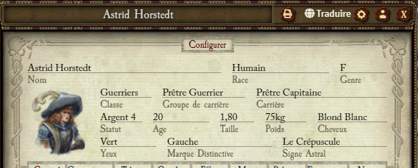

# WFRP 4 Actor Sheet Print

This module allow to export characters sheet on a friendly print pdf.

# Authors

Skeroujvapluvit

## Supported language

- All

## System and dependencies

This module need the Warhammer Fantasy Roleplay 4e system

- System : https://foundryvtt.com/packages/wfrp4e

### Optional dependencies

### External dependencies

- jsPDF : https://github.com/parallax/jsPDF

## Usage

A print buton is added on top of sheet to export as pdf

## Comming soon

## Module link

https://raw.githubusercontent.com/mcailleaux/WFRP4-FoundryVTT-wfrp4e-actor-sheet-print/dist/module.json

## Module Beta link

https://raw.githubusercontent.com/mcailleaux/WFRP4-FoundryVTT-wfrp4e-actor-sheet-print/dist-beta/module-beta.json
